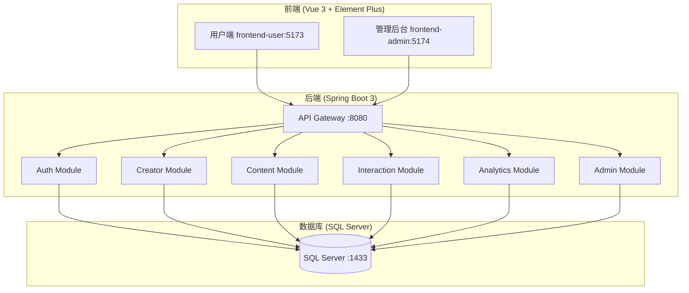
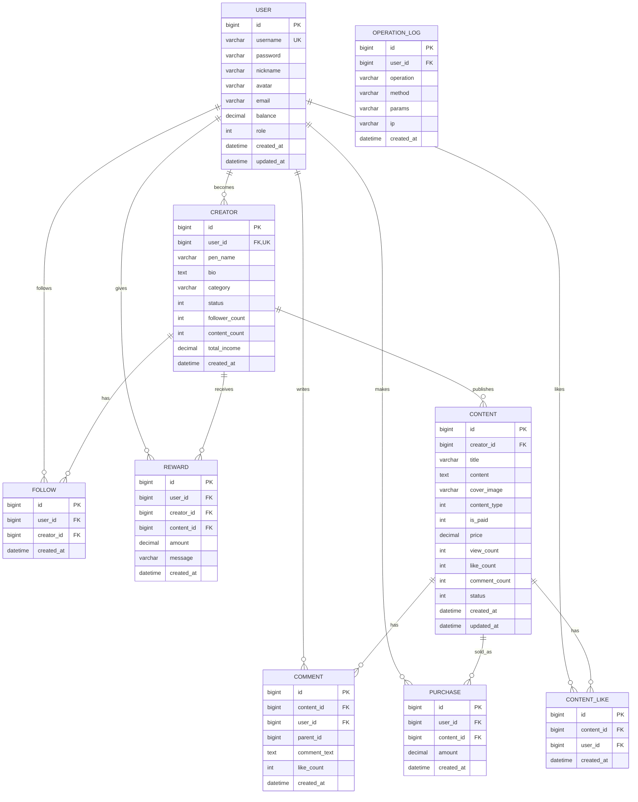

# 原创内容创作者支持平台 - 系统设计文档

## 1. 系统架构



## 2. ER 图



## 3. 接口清单

### 3.1 认证模块 (AuthController)

| Method | Endpoint           | Description      | Auth |
| ------ | ------------------ | ---------------- | ---- |
| POST   | /api/auth/register | 用户注册         | No   |
| POST   | /api/auth/login    | 用户登录         | No   |
| GET    | /api/auth/info     | 获取当前用户信息 | Yes  |
| PUT    | /api/auth/profile  | 更新用户资料     | Yes  |
| POST   | /api/auth/recharge | 账户充值         | Yes  |

### 3.2 创作者模块 (CreatorController)

| Method | Endpoint             | Description        | Auth |
| ------ | -------------------- | ------------------ | ---- |
| POST   | /api/creator/apply   | 申请成为创作者     | Yes  |
| GET    | /api/creator/profile | 获取当前创作者资料 | Yes  |
| PUT    | /api/creator/profile | 更新创作者资料     | Yes  |
| GET    | /api/creator/list    | 获取创作者列表     | No   |
| GET    | /api/creator/{id}    | 获取创作者详情     | No   |

### 3.3 内容模块 (ContentController)

| Method | Endpoint                         | Description      | Auth |
| ------ | -------------------------------- | ---------------- | ---- |
| POST   | /api/content                     | 发布内容         | Yes  |
| PUT    | /api/content/{id}                | 更新内容         | Yes  |
| DELETE | /api/content/{id}                | 删除内容         | Yes  |
| GET    | /api/content/{id}                | 获取内容详情     | No   |
| GET    | /api/content/list                | 获取内容列表     | No   |
| GET    | /api/content/my                  | 获取我的内容列表 | Yes  |
| GET    | /api/content/creator/{creatorId} | 获取创作者的内容 | No   |
| POST   | /api/content/{id}/purchase       | 购买付费内容     | Yes  |

### 3.4 互动模块 (InteractionController)

| Method | Endpoint                         | Description  | Auth |
| ------ | -------------------------------- | ------------ | ---- |
| POST   | /api/follow/{creatorId}          | 关注创作者   | Yes  |
| DELETE | /api/follow/{creatorId}          | 取消关注     | Yes  |
| GET    | /api/follow/list                 | 获取关注列表 | Yes  |
| GET    | /api/follow/check/{creatorId}    | 检查关注状态 | Yes  |
| POST   | /api/reward                      | 打赏创作者   | Yes  |
| GET    | /api/reward/list                 | 获取打赏记录 | Yes  |
| GET    | /api/comment/content/{contentId} | 获取内容评论 | No   |
| POST   | /api/comment                     | 发表评论     | Yes  |
| DELETE | /api/comment/{id}                | 删除评论     | Yes  |
| POST   | /api/like/{contentId}            | 点赞内容     | Yes  |
| DELETE | /api/like/{contentId}            | 取消点赞     | Yes  |
| GET    | /api/like/check/{contentId}      | 检查点赞状态 | Yes  |

### 3.5 数据看板模块 (AnalyticsController)

| Method | Endpoint                | Description  | Auth |
| ------ | ----------------------- | ------------ | ---- |
| GET    | /api/analytics/overview | 获取数据概览 | Yes  |
| GET    | /api/analytics/income   | 获取收入统计 | Yes  |
| GET    | /api/analytics/content  | 获取内容统计 | Yes  |
| GET    | /api/analytics/fans     | 获取粉丝统计 | Yes  |

### 3.6 管理后台模块 (AdminController)

| Method | Endpoint                       | Description    | Auth  |
| ------ | ------------------------------ | -------------- | ----- |
| GET    | /api/admin/users               | 用户管理列表   | Admin |
| PUT    | /api/admin/user/{id}/status    | 更新用户状态   | Admin |
| GET    | /api/admin/creators            | 创作者审核列表 | Admin |
| PUT    | /api/admin/creator/{id}/audit  | 审核创作者     | Admin |
| GET    | /api/admin/contents            | 内容管理列表   | Admin |
| PUT    | /api/admin/content/{id}/status | 更新内容状态   | Admin |
| GET    | /api/admin/statistics          | 平台统计数据   | Admin |
| GET    | /api/admin/logs                | 操作日志列表   | Admin |

### 3.7 文件上传模块 (UploadController)

| Method | Endpoint          | Description | Auth |
| ------ | ----------------- | ----------- | ---- |
| POST   | /api/upload/image | 上传图片    | Yes  |

## 4. 页面路由

### 4.1 用户端 (frontend-user)

| 路由            | 页面              | 权限   | 说明           |
| --------------- | ----------------- | ------ | -------------- |
| /               | Home.vue          | 公开   | 首页           |
| /login          | Login.vue         | 公开   | 登录           |
| /register       | Register.vue      | 公开   | 注册           |
| /creators       | Creators.vue      | 公开   | 发现创作者     |
| /creator/:id    | CreatorDetail.vue | 公开   | 创作者详情     |
| /content/:id    | ContentDetail.vue | 公开   | 内容详情       |
| /profile        | Profile.vue       | 登录   | 个人中心       |
| /my-follows     | MyFollows.vue     | 登录   | 我的关注       |
| /apply-creator  | ApplyCreator.vue  | 登录   | 申请成为创作者 |
| /creator-center | CreatorCenter.vue | 创作者 | 创作中心       |
| /publish        | Publish.vue       | 创作者 | 发布内容       |
| /edit/:id       | Publish.vue       | 创作者 | 编辑内容       |
| /dashboard      | Dashboard.vue     | 创作者 | 数据看板       |

### 4.2 管理后台 (frontend-admin)

| 路由      | 页面          | 权限  | 说明       |
| --------- | ------------- | ----- | ---------- |
| /login    | Login.vue     | 公开  | 管理员登录 |
| /         | Dashboard.vue | Admin | 数据概览   |
| /users    | Users.vue     | Admin | 用户管理   |
| /creators | Creators.vue  | Admin | 创作者审核 |
| /contents | Contents.vue  | Admin | 内容管理   |
| /logs     | Logs.vue      | Admin | 操作日志   |

## 5. UI/UX 规范

### 5.1 色彩系统

```scss
// 主色调 - 活力橙红
$primary-color: #ff6b5b;
$primary-light: #ff8a7a;
$primary-dark: #e55a4a;

// 辅助色
$accent-color: #667eea;
$success-color: #10b981;
$warning-color: #f59e0b;
$danger-color: #ef4444;
$info-color: #3b82f6;

// 中性色
$text-primary: #1f2937;
$text-secondary: #6b7280;
$text-muted: #9ca3af;
$border-color: #e5e7eb;
$border-light: #f3f4f6;
$background-color: #f9fafb;
$card-background: #ffffff;

// 渐变
$gradient-primary: linear-gradient(135deg, #ff6b5b, #ff8e53);
$gradient-accent: linear-gradient(135deg, #667eea, #764ba2);
$gradient-warm: linear-gradient(135deg, #fff9f7, #ffe8e0);
```

### 5.2 字体规范

```scss
$font-family: "Inter", "PingFang SC", "Microsoft YaHei", sans-serif;
$font-size-xs: 12px;
$font-size-sm: 14px;
$font-size-base: 16px;
$font-size-lg: 18px;
$font-size-xl: 20px;
$font-size-2xl: 24px;
$font-size-3xl: 30px;

$font-weight-normal: 400;
$font-weight-medium: 500;
$font-weight-semibold: 600;
$font-weight-bold: 700;
```

### 5.3 间距系统

```scss
$spacing-xs: 4px;
$spacing-sm: 8px;
$spacing-md: 16px;
$spacing-lg: 24px;
$spacing-xl: 32px;
$spacing-2xl: 48px;
$spacing-3xl: 64px;
```

### 5.4 圆角与阴影

```scss
$border-radius-sm: 4px;
$border-radius-md: 8px;
$border-radius-lg: 12px;
$border-radius-xl: 16px;
$border-radius-2xl: 24px;
$border-radius-full: 9999px;

$shadow-sm: 0 1px 2px rgba(0, 0, 0, 0.05);
$shadow-md: 0 4px 6px -1px rgba(0, 0, 0, 0.1);
$shadow-lg: 0 10px 15px -3px rgba(0, 0, 0, 0.1);
$shadow-xl: 0 20px 25px -5px rgba(0, 0, 0, 0.1);
```

### 5.5 动画过渡

```scss
$transition-fast: 0.15s ease;
$transition-base: 0.3s ease;
$transition-slow: 0.5s ease;
```

## 6. 技术栈

### 后端

- Java 17
- Spring Boot 3.2.x
- MyBatis-Plus 3.5.x
- SQL Server 2022 (JDBC Driver)
- JWT 认证 (jjwt 0.12.x)
- Lombok
- AOP 操作日志
- Slf4j + Logback

### 前端

- Vue 3.4.x (Composition API)
- Vite 5.x
- Element Plus 2.6.x
- Pinia (状态管理)
- Vue Router 4
- Axios (HTTP 客户端)
- SCSS (样式预处理)
- ECharts 5.x (数据可视化)

### 部署

- Docker & Docker Compose
- Nginx (前端静态资源)

## 7. 核心功能说明

### 7.1 创作者入驻流程

1. 用户注册并登录
2. 进入"申请成为创作者"页面
3. 填写笔名、简介、创作领域
4. 提交申请，状态变为"待审核"
5. 管理员在后台审核
6. 审核通过后，用户 role 变为 1（创作者）
7. 创作者可进入创作中心发布内容

### 7.2 付费内容购买流程

1. 用户浏览付费内容，显示部分预览
2. 点击"购买"按钮
3. 系统检查用户余额
4. 余额充足则扣款，创建购买记录
5. 创作者收入增加
6. 用户可查看完整内容

### 7.3 打赏流程

1. 用户在创作者主页或内容页点击"打赏"
2. 选择或输入打赏金额
3. 可选填打赏留言
4. 系统扣除用户余额
5. 创作者收入增加
6. 打赏记录显示在数据看板

### 7.4 数据看板统计

- 总收入：打赏收入 + 付费内容收入
- 粉丝数：关注该创作者的用户数
- 作品数：已发布的内容数量
- 总浏览：所有内容的浏览量总和
- 收入趋势：按日期统计的收入变化
- 最近打赏：最新的打赏记录列表
